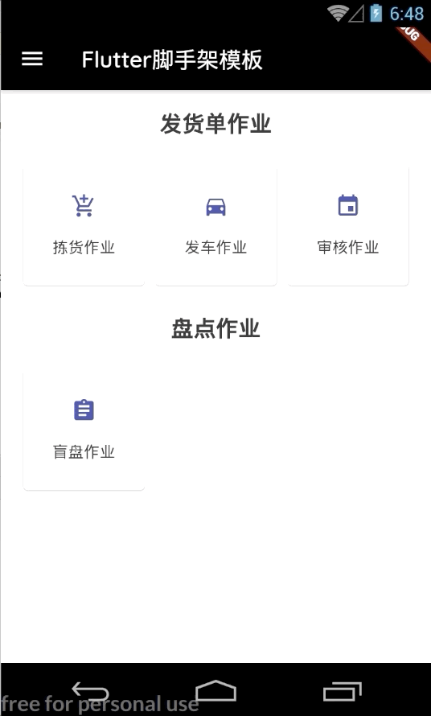
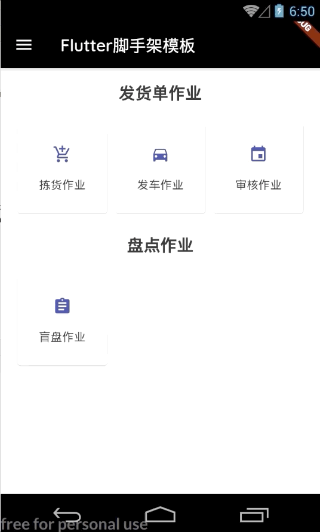
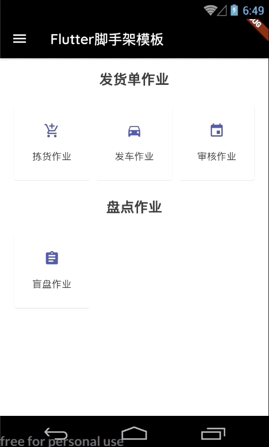
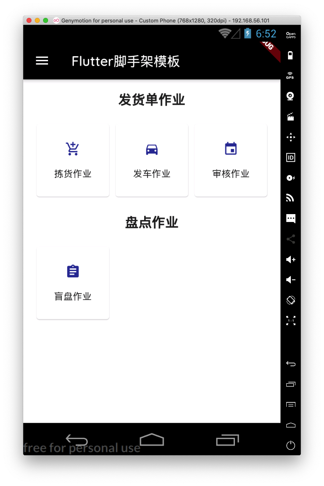
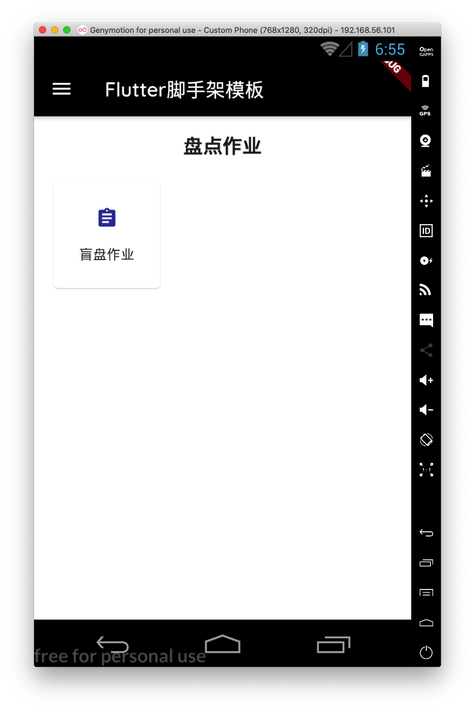

## Flutter脚手架模板

`flutter_cli_project` 是由于我最近需要开发 `Flutter` 相关 `APP` 搭建出来的架构底座，可用于所有的程序，该底座集成了一些功能：

1. `BloC` 状态管理；
2. `i18n` 配置与切换；
3. `profile` 环境配置；
4. `MockData` 程序，懒加载，常用于开发的时候使用；
5. `dio` + `protolbuf` 数据传输协议；
6. 路由跳转动画过度（`Hero` 动画）；
7. `Toast` 工具包
8. 用户权限管理；

开发了一些通用的核心类，可用于实现以上的功能。

## i18n工具包

核心工具包：`I18nBox`，通过程序启动，加载 `assets/lang` 对应的语言配置，放置于全局的 `BloC` 状态中，可以随时切换：



## 主题切换

原理同上，交由系统状态器管理，可以在 `lib/personal/theme_setting.dart` 以及 `lib/personal/themes.dart` 配置满足需求的主题数据：



## 路由动画切换

这个就是简单的使用 `Hero` 动画，感觉还是蛮好看的，在 `dashboard` 进行渲染菜单的时候，使用跳转的路由路径作为 `Hero` 的 `tag`，对应的页面继承封装的 `Page` 对象进行路由路径注入，从而形成相同的 `Hero` `tage` 即可完成路由切换。



## Profile配置管理

经常的我们需要多个环境进行 `APP` 的开发，这就涉及到了 `prod` `test` 以及 `uat` 环境：

```json
assets/profile-config.json
{
  "profile.active": "mock",
  "baseURL.dev": "http://192.168.1.152:8002/",
  "baseURL.uat": "https://api.xxx.com/",
  "baseURL.prod": "https://api.xxx.com/",
  "baseURL.mock": "" // mock不需要url
}
```

那么我们项目中只需要通过 `ProfilesLoader.keyOf('baseURL;)` 即可获取到 `baseURL` 在配置的 `profile.active` 下对应的值。

## Ioc容器

借用后端的思路，把常用的对象放在一个容器中，以便让全局程序使用同一个单例。

路径：`lib/infrastructure/ioc_container.dart`

## 权限管理和Mock数据

`Mock` 数据集：`lib/mock/mock_holder.dart`

支持 `URL` 参数区分不同 `Handler`（类似于 `SpringMVC` 的 `params` 属性），注册 `URL` 信息到上面的类中，在开发使用 `mock` 的 `profile` 的时候，`NetTool` 即可查找到对应的 `Handler` 继而返回需要的数据。

测试用例：`test/net_tool_box_test.dart`

类似于用户登录授权：

```dart
lib/mock/mock_data/user_data.dart
PbResultDto userAuthenticate<P extends $pb.GeneratedMessage>({
  P body,
  Map<String, String> param
}) {
  UserAuthenticateReqDto req = body as UserAuthenticateReqDto;
  UserAuthenticateRespDto r = UserAuthenticateRespDto();
  if (req.userName == 'Weidan') {
    r.token = '112233';
    r.resourceCodes.addAll(['deliverBillPick', 'deliverBillPick2']);
  } else {
    r.token = '334455';
    r.resourceCodes.addAll(['deliverBillPick2']);
  }

  PbResultDto pbResultDto = PbResultDto();
  pbResultDto.data = Any.pack(r);
  return pbResultDto;
}
```

## dashboard和权限管理

可以从上面看到，不同的登陆用户名有不同的权限集：

`Weidan` 账号登陆：



`其他登陆`：



可在 `dashboard` 中注册菜单、图表、路由以及需要的权限，`dashboard` 将会自动按需求渲染入口：

```dart
lib/personal/dashboard_page.dart:14
class DashboardPage extends PageStateLess {

  List<Widget> _menuList(SystemState systemState, AuthenticationAuthenticated state, BuildContext buildContext) {
    List<_MenuBtn> menuBtns = [];
    /// 开始定义面板的功能按钮，第一个参数是以及标题，将会自动分类
    /// 第二个是对应的菜单名字的 i18n-key
    /// 第三个图表，第四个入口需要的权限
    menuBtns.add(_MenuBtn(
        'dashboard.deliver.bill.title', 'dashboard.deliver.bill.pick',
        Icons.add_shopping_cart, 'deliverBillPick', DeliverBillPickIndexConst.pickIndexPath));
    menuBtns.add(_MenuBtn(
        'dashboard.deliver.bill.title', 'dashboard.deliver.bill.deliver',
        Icons.directions_car, 'deliverBillPick', DeliverBillPickIndexConst.loadingIndexPath));
    menuBtns.add(_MenuBtn(
        'dashboard.deliver.bill.title', 'dashboard.deliver.bill.audit',
        Icons.event, 'deliverBillPick', DeliverBillPickIndexConst.auditIndexPath));
    menuBtns.add(_MenuBtn(
        'dashboard.check.bill.title', 'dashboard.check.bill.auditing',
        Icons.assignment, 'deliverBillPick2', CheckBillIndexConst.checkBillIndexPath));
    return _caculateMenuRow(systemState, state, menuBtns, buildContext);
  }
  //...
}
```


